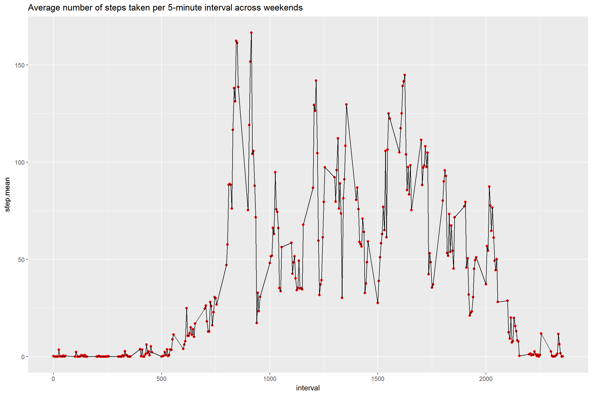

Reproducible Research Course - Project 1
========================================

It is now possible to collect a large amount of data about personal
movement using activity monitoring devices such as a Fitbit, Nike
Fuelband, or Jawbone Up. These type of devices are part of the
"quantified self" movement - a group of enthusiasts who take
measurements about themselves regularly to improve their health, to find
patterns in their behavior, or because they are tech geeks. But these
data remain under-utilized both because the raw data are hard to obtain
and there is a lack of statistical methods and software for processing
and interpreting the data.

This assignment makes use of data from a personal activity monitoring
device. This device collects data at 5 minute intervals through out the
day. The data consists of two months of data from an anonymous
individual collected during the months of October and November, 2012 and
include the number of steps taken in 5 minute intervals each day.

    knitr::opts_chunk$set(fig.width=12, fig.height=8, fig.path='Figs/', warning=FALSE, message=FALSE)
    library(plyr)

    ## Warning: package 'plyr' was built under R version 3.3.2

    library(ggplot2)

    ## Warning: package 'ggplot2' was built under R version 3.3.2

    library(dplyr)

    ## Warning: package 'dplyr' was built under R version 3.3.2

    ## 
    ## Attaching package: 'dplyr'

    ## The following objects are masked from 'package:plyr':
    ## 
    ##     arrange, count, desc, failwith, id, mutate, rename, summarise,
    ##     summarize

    ## The following objects are masked from 'package:stats':
    ## 
    ##     filter, lag

    ## The following objects are masked from 'package:base':
    ## 
    ##     intersect, setdiff, setequal, union

1- Code for reading in the dataset and/or processing the data

    setwd("C://DataScienceProgram//Reproducible//week2")
    activity <- read.csv("activity1.csv")
    colnames(activity)[2] <- c("ActivityDate")
    summary(activity)

    ##      steps            ActivityDate      interval     
    ##  Min.   :  0.00   2012-10-01:  288   Min.   :   0.0  
    ##  1st Qu.:  0.00   2012-10-02:  288   1st Qu.: 588.8  
    ##  Median :  0.00   2012-10-03:  288   Median :1177.5  
    ##  Mean   : 37.38   2012-10-04:  288   Mean   :1177.5  
    ##  3rd Qu.: 12.00   2012-10-05:  288   3rd Qu.:1766.2  
    ##  Max.   :806.00   2012-10-06:  288   Max.   :2355.0  
    ##  NA's   :2304     (Other)   :15840

2- Histogram of the total number of steps taken each day

    count <- aggregate(steps ~ ActivityDate, activity, FUN = "sum")
    summary(count)

    ##      ActivityDate     steps      
    ##  2012-10-02: 1    Min.   :   41  
    ##  2012-10-03: 1    1st Qu.: 8841  
    ##  2012-10-04: 1    Median :10765  
    ##  2012-10-05: 1    Mean   :10766  
    ##  2012-10-06: 1    3rd Qu.:13294  
    ##  2012-10-07: 1    Max.   :21194  
    ##  (Other)   :47

    g<- ggplot(data= count, aes( count$steps) ) + geom_histogram(col="red", fill="green") + labs(title = "Total number of steps per day")+labs(y="Number of Steps")
    print(g)

3-Mean and median number of steps taken each day

    StepsMean <- aggregate(steps ~ ActivityDate, activity, FUN = "mean")
    StepsMedian <- aggregate(steps ~ ActivityDate, activity, FUN = "median")
    n<- join(StepsMean, StepsMedian, by = "ActivityDate" )
    colnames(n)[2]<- c("Mean")
    colnames(n)[3]<- c("Median")
    print(n)

    ##    ActivityDate       Mean Median
    ## 1    2012-10-02  0.4375000      0
    ## 2    2012-10-03 39.4166667      0
    ## 3    2012-10-04 42.0694444      0
    ## 4    2012-10-05 46.1597222      0
    ## 5    2012-10-06 53.5416667      0
    ## 6    2012-10-07 38.2465278      0
    ## 7    2012-10-09 44.4826389      0
    ## 8    2012-10-10 34.3750000      0
    ## 9    2012-10-11 35.7777778      0
    ## 10   2012-10-12 60.3541667      0
    ## 11   2012-10-13 43.1458333      0
    ## 12   2012-10-14 52.4236111      0
    ## 13   2012-10-15 35.2048611      0
    ## 14   2012-10-16 52.3750000      0
    ## 15   2012-10-17 46.7083333      0
    ## 16   2012-10-18 34.9166667      0
    ## 17   2012-10-19 41.0729167      0
    ## 18   2012-10-20 36.0937500      0
    ## 19   2012-10-21 30.6284722      0
    ## 20   2012-10-22 46.7361111      0
    ## 21   2012-10-23 30.9652778      0
    ## 22   2012-10-24 29.0104167      0
    ## 23   2012-10-25  8.6527778      0
    ## 24   2012-10-26 23.5347222      0
    ## 25   2012-10-27 35.1354167      0
    ## 26   2012-10-28 39.7847222      0
    ## 27   2012-10-29 17.4236111      0
    ## 28   2012-10-30 34.0937500      0
    ## 29   2012-10-31 53.5208333      0
    ## 30   2012-11-02 36.8055556      0
    ## 31   2012-11-03 36.7048611      0
    ## 32   2012-11-05 36.2465278      0
    ## 33   2012-11-06 28.9375000      0
    ## 34   2012-11-07 44.7326389      0
    ## 35   2012-11-08 11.1770833      0
    ## 36   2012-11-11 43.7777778      0
    ## 37   2012-11-12 37.3784722      0
    ## 38   2012-11-13 25.4722222      0
    ## 39   2012-11-15  0.1423611      0
    ## 40   2012-11-16 18.8923611      0
    ## 41   2012-11-17 49.7881944      0
    ## 42   2012-11-18 52.4652778      0
    ## 43   2012-11-19 30.6979167      0
    ## 44   2012-11-20 15.5277778      0
    ## 45   2012-11-21 44.3993056      0
    ## 46   2012-11-22 70.9270833      0
    ## 47   2012-11-23 73.5902778      0
    ## 48   2012-11-24 50.2708333      0
    ## 49   2012-11-25 41.0902778      0
    ## 50   2012-11-26 38.7569444      0
    ## 51   2012-11-27 47.3819444      0
    ## 52   2012-11-28 35.3576389      0
    ## 53   2012-11-29 24.4687500      0

4-Time series plot of the average number of steps taken

    StepsMeanOverTimeIntervals<- aggregate(steps ~ interval, activity, FUN = "mean")
    g<- ggplot(data= StepsMeanOverTimeIntervals, aes(interval, steps) )+ geom_point(col="red")+ labs(title = "Time series plot of the average number of steps taken")+labs(x="Intervals", y="mean number of the steps") +geom_line()
    print(g)

5-The 5-minute interval that, on average, contains the maximum number of
steps

    m <- max(StepsMeanOverTimeIntervals[2], na.rm = TRUE)
    n <- which.max(as.double(StepsMeanOverTimeIntervals[[2]]))
    h<- StepsMeanOverTimeIntervals[[n,1]]
    print(h)

    ## [1] 835

Interval 835 has the maximum average number of steps

6- Code to describe and show a strategy for imputing missing data

    #copy the data in another dataframe
    activityCpy <- activity 
    #get the rows with NA
    n <- which(is.na(activityCpy))
    for (i in 1:length(n)) {
      index <- n[i]
      intervalOfNA <- activityCpy[index,3]
      
      MeanOfTheInterval <- StepsMeanOverTimeIntervals[which(StepsMeanOverTimeIntervals[,1] ==    intervalOfNA),2]
      #replace the NA in steps with the mean for that 5-minute interval
      activityCpy[index,1] <- MeanOfTheInterval
    }
    summary(activityCpy)

    ##      steps            ActivityDate      interval     
    ##  Min.   :  0.00   2012-10-01:  288   Min.   :   0.0  
    ##  1st Qu.:  0.00   2012-10-02:  288   1st Qu.: 588.8  
    ##  Median :  0.00   2012-10-03:  288   Median :1177.5  
    ##  Mean   : 37.38   2012-10-04:  288   Mean   :1177.5  
    ##  3rd Qu.: 27.00   2012-10-05:  288   3rd Qu.:1766.2  
    ##  Max.   :806.00   2012-10-06:  288   Max.   :2355.0  
    ##                   (Other)   :15840

Notice that there is no NAs in the dataset copy now!

The Mean is 1177.5, The Median :1177.5

Notice the sligh diffrance in Mean and Meadian

7-Histogram of the total number of steps taken each day after missing
values are imputed

    count <- aggregate(steps ~ ActivityDate, activityCpy, FUN = "sum")
    g<- ggplot(data= count, aes( count$steps) ) + geom_histogram(col="red", fill="green") + labs(title = "Total number of steps per day after missing values are imputed")+labs(y="Number of Steps")
    print(g)

8- Panel plot comparing the average number of steps taken per 5-minute
interval across weekdays and weekends

    activityCpy$ActivityDate <- as.Date(activityCpy$ActivityDate)
    weekdays1 <- c('Monday', 'Tuesday', 'Wednesday', 'Thursday', 'Friday')
    activityCpy$wDay <- factor((weekdays(activityCpy$ActivityDate) %in% weekdays1), levels=c(FALSE, TRUE), labels=c('weekend','weekday') )
    #subset and group by interval
    weekends <- activityCpy %>% filter(wDay=="weekend") %>% group_by(interval) %>%summarise(step.mean = mean(steps))
    weekdays <- activityCpy %>% filter(wDay=="weekday") %>% group_by(interval) %>%summarise(step.mean = mean(steps))

    weekendsPlot<- ggplot(data= weekends, aes(interval, step.mean) )+ geom_point(col="red")+geom_line()+labs(title = "Average number of steps taken per 5-minute interval across weekends")
    print(weekendsPlot)

    weekdaysPlot<- ggplot(data= weekdays, aes(interval, step.mean) )+ geom_point(col="red")+geom_line()+labs(title = "Average number of steps taken per 5-minute interval across weekdays")
    print(weekdaysPlot)

